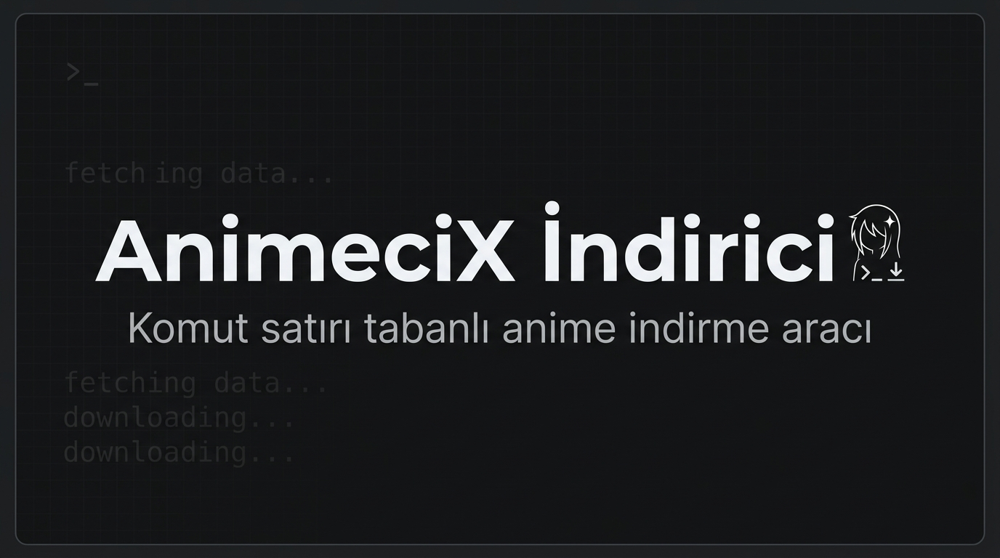

<div align="center">
  
  
  <h1>🌟 AnimeciX Downloader</h1>
  
  <p><b>AnimeciX üzerinden en yüksek kalitede, gizli sunucu kısıtlamalarını aşarak otomatik anime indirme aracı.</b></p>
  
  <p>
    <a href="https://github.com/Teknoist/animecix-downloader/releases"></a>
    <a href="https://www.python.org/downloads/"></a>
    <a href="https://github.com/yt-dlp/yt-dlp"></a>
    <a href="https://github.com/Teknoist/animecix-downloader/blob/master/LICENSE"></a>
  </p>
</div>

---

## ⚡ Özellikler

- **🤖 Akıllı URL Analizi**: Sadece linki yapıştırın, araç gerisini halletsin. Sezon sayfasından mı yoksa doğrudan bölüm sayfasından mı geldiğinizi otomatik algılar.
- **📁 Kusursuz Arşivleme**: Animeleri `İndirilenler / [Anime Adı] / [Sezon Numarası]` şeklinde düzenli klasörlere ayırır. Karmaşaya son!
- **🎛️ Etkileşimli CLI (Komut Satırı)**: Linki verdiğinizde size sorar:
  - 🎬 Tüm sezonu mu indireyim?
  - 🎯 Sadece 5. bölümü mü indireyim?
  - 📊 3 ile 8. bölümler arasını mı indireyim?
- **💎 Maksimum Kalite**: `yt-dlp` altyapısını kullanarak sunucudaki en iyi videoyu (1080p, en iyi ses kodlaması) kayıpsız çeker.
- **🕵️ Gizli İframe ve Network Dinleme**: AnimeciX gibi Angular ile yazılmış ve videoları gizli M3U8/MP4 iframelerinde tutan sistemleri Playwright ile tam bir tarayıcı simülasyonu yaratarak (Headless) atlatır.
- **🔄 Otomatik Fansub Atlatma**: "SeiCode", "Eternal", "TenseiSubs" gibi çeviri butonlarını analiz edip en stabil çalışan video sunucusuna (örn: tau-video.xyz) otomatik bağlanır.

## 🚀 Kurulum

Aracı kullanmaya başlamak çok basittir. İşletim sisteminizde [Python 3.8+](https://www.python.org/) kurulu olduğundan emin olun.

1. **Projeyi indirin:**
   ```bash
   git clone https://github.com/Teknoist/animecix-downloader.git
   cd animecix-downloader
   ```

2. **Gerekli paketleri kurun:**
   ```bash
   pip install -r requirements.txt
   ```

3. **Playwright Tarayıcı Motorunu indirin:**
   Arka planda sayfa analizleri için ufak bir Chromium tarayıcıya ihtiyaç vardır:
   ```bash
   playwright install chromium
   ```

## 🎮 Kullanım Rehberi

Terminal veya Komut İstemini (CMD) açarak uygulamayı çalıştırın. İstediğiniz bir dizinin sezon veya spesifik bir bölüm linkini yapıştırabilirsiniz.

### Temel Kullanım

```bash
python animecix_dl.py "https://animecix.tv/titles/11374/tensei-shitara-dai-nana-ouji-datta-node,-kimamani-majutsu-wo-kiwamemasu/season/2"
```

Program size 3 seçenek sunacaktır:
```text
Toplam 12 bölüm tespit edildi.
[1] Tüm sezonu indir
[2] Sadece belirli bir bölümü indir (Örn: 5)
[3] Belirli bir bölüm aralığını indir (Örn: 3-8)
Seçiminiz [1]: 
```

Seçiminizi yaptıktan sonra arkanıza yaslanın. Program arka planda sayfaları gezecek, fansubları tespit edecek, gizli `MP4` linklerini yakalayacak ve sırayla indirecektir.

### Gelişmiş Komutlar

Sürekli aynı şeyleri sorup durmasını istemiyorsanız ve bir otomasyon scripti yazıyorsanız (Tüm bölümleri direkt indirmesi için):
```bash
python animecix_dl.py "LİNK" --all
```

Kayıt yerini farklı bir disk veya klasör yapmak isterseniz:
```bash
python animecix_dl.py "LİNK" --output "D:\Anime Arşivim"
```

## 📂 Çıktı Klasör Yapısı Örneği
```text
D:\Anime Arşivim\
└── Tensei Shitara Dai Nana Ouji Datta Node Kimamani Majutsu Wo Kiwamemasu\
    └── Sezon_2\
        ├── Episode_01.mp4
        ├── Episode_02.mp4
        └── Episode_03.mp4
```

## 🛠️ Nasıl Çalışıyor? (Wiki Özeti)

1. **Routing Analizi**: AnimeciX Angular ile SPA (Tek Sayfa Uygulaması) olarak çalışır. Sayfa yüklenince API istekleri JavaScript ile tamamlanır.
2. **Headless Browser**: Kodlarımız `Playwright` kullanarak hayalet bir Chromium sekmesi açar ve 5 saniye bekleyerek tüm UI'ın yüklenmesini sağlar.
3. **Regex & Scraping**: URL üzerinden `season` keyword'ünü bularak sezonu, `titles` keyword'ünü bularak dizinin adını yakalar ve özel karakterlerden arındırır.
4. **Network Interception**: Çeviri gruplarından birine otomatik tıklanır. Site içerisine "tau-video" veya "embed" ile başlayan bir iframe yüklenir. Program bu Iframe adresine özel olarak gider ve ağ trafik sekmesinde `*.mp4` veya `*.m3u8` içeren ilk paketi dinler.
5. **yt-dlp**: Yakalanan bu direkt streaming adresi, endüstri standardı `yt-dlp` yazılımına devredilir ve maksimum hızda donanıma yazılır.

## 📜 Lisans

Bu proje, açık kaynaklı kodlama felsefesiyle ve eğitim amacıyla üretilmiştir. MIT Lisansı altındadır.
Üretici: Antigravity AI
